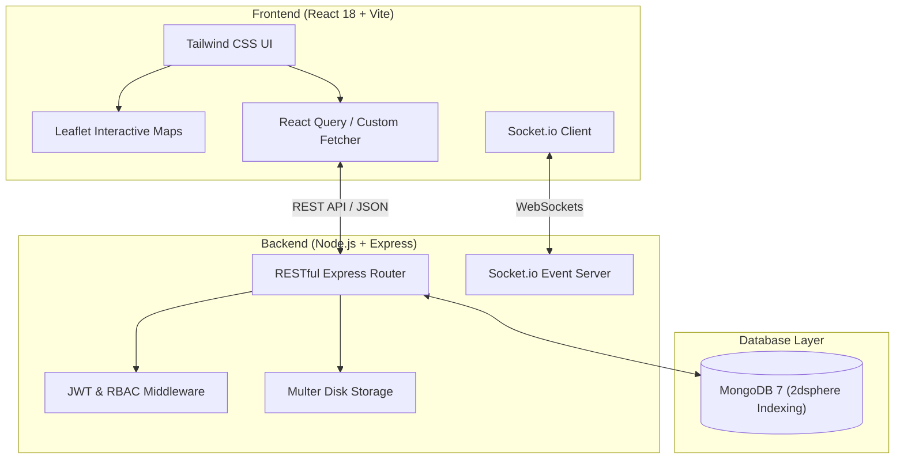

# 🏙️ Community-Sense (CivicSolve)
### Modern Civic Issue Reporting & Municipal Management Platform

> A production-ready full-stack web platform enabling citizens to report local infrastructure issues, track complaint resolution in real time, and engage with public notices — while municipal authorities monitor, manage, and resolve reports through an interactive geospatial dashboard.

[](https://nodejs.org)
[](https://expressjs.com)
[](https://react.dev)
[](https://vitejs.dev)
[](https://mongodb.com)
[](https://socket.io)
[](https://www.docker.com)

---

## 📌 Table of Contents
- [✨ Features](#-features)
- [🏗️ Architecture & Stack](#%EF%B8%8F-architecture--stack)
- [🔄 Complaint Lifecycle & Role Enforcement](#-complaint-lifecycle--role-enforcement)
- [🚀 Quick Start & Installation](#-quick-start--installation)
- [🔑 Demo Credentials & Seeding](#-demo-credentials--seeding)
- [📡 API Documentation](#-api-documentation)
- [🧪 Testing & Quality Assurance](#-testing--quality-assurance)
- [📁 Directory Structure](#-directory-structure)
- [📄 License](#-license)

---

## ✨ Features

### 🌐 For Citizens
- 🗺️ **Geospatial Issue Mapping** — Report civic complaints on an interactive Leaflet map using current GPS location or map click coordinates.
- 📷 **Photo Verification** — Upload issue photos directly with Multer multi-file upload support.
- 🔍 **Proximity & Radius Search** — Find nearby civic issues within customizable radiuses (1–50 km) using MongoDB `2dsphere` spatial indexing and Haversine distance calculation.
- 💬 **Community Engagement** — Upvote reports to increase urgency, post comments, and subscribe to status update streams.
- 📢 **Public Civic Notices** — View emergency alerts, scheduled road closures, and utility outage announcements published by authorities.
- 📊 **Personal Complaint Dashboard** — Track the lifecycle of reported complaints from initial submission to closure.

### 🏛️ For Municipal Authorities
- 📈 **Authority Management Dashboard** — Overview of incoming issues, severity breakdowns, category counts, and geographic heatmaps.
- 🛡️ **Role-Based Status Control** — Transition issues through `Reported → Acknowledged → In Progress → Resolved`. Requires mandatory resolution notes and optional proof-of-work photo uploads.
- 📢 **Public Notice Dispatcher** — Create, edit, and broadcast location-tagged municipal announcements with start and end valid times.
- ⚡ **Real-Time Synchronized Feeds** — Socket.io WebSocket integration ensures instant updates across all active admin and user sessions without full page reloads.

---

## 🏗️ Architecture & Stack



### Technology Breakdown

| Component | Technology | Description |
|---|---|---|
| **Frontend** | React 18, Vite, Tailwind CSS, Leaflet, React Query, Recharts | Fast single-page application with responsive styling and GIS map visualization. |
| **Backend** | Node.js, Express.js, Socket.io | REST API service with real-time WebSocket event broadcasting. |
| **Database** | MongoDB 7, Mongoose ODM | Document database utilizing `2dsphere` spatial indexing, soft deletes, and aggregate pipelines. |
| **Security & Auth**| JWT, Bcrypt.js, Express-Validator, Helmet, CORS | Token-based auth, password hashing, request payload validation, and CSP protection. |
| **DevOps & Infra** | Docker, Docker-Compose, Nginx, PowerShell Startup | Multi-container setup orchestrating DB, API backend, and static web server. |

---

## 🔄 Complaint Lifecycle & Role Enforcement

`Community-Sense` strictly enforces a state machine to ensure civic transparency and prevent unauthorized status manipulation:

```
 [ Citizen Reports ] ──► ( Reported )
                            │
                      [ Authority ]
                            ▼
                     ( Acknowledged )
                            │
                      [ Authority ]
                            ▼
                    ( In Progress )
                            │
                      [ Authority ]
                            ▼
                      ( Resolved )
                            │
                      [ Citizen ]
                            ▼
                       ( Closed )
```

### 🔒 Access Rules
1. **Status Transition Authority**: Only users with the `authority` role can change status to `acknowledged`, `in_progress`, or `resolved`.
2. **Mandatory Resolution Notes**: Authorities must attach a status description note when updating issue status.
3. **Citizen Verification (Closing)**: An issue can **only be closed by the citizen who originally reported it**. Authorities cannot close complaints.
4. **Immutability**: Once an issue status reaches `closed`, it cannot be reopened or edited.
5. **Audit History (`statusHistory`)**: Every status change generates an auditable history record containing timestamp, acting user ID, note, and progress images.

---

## 🚀 Quick Start & Installation

### Option 1: Docker Compose *(Recommended)*

Prerequisites: [Docker Desktop](https://www.docker.com/products/docker-desktop/) installed.

```bash
# 1. Clone repository
git clone https://github.com/Sayeesh12/Community-sense.git
cd Community-sense

# 2. Copy environment file
cp .env.example .env

# 3. Launch container stack
docker-compose up --build -d
```

| Service | Access URL |
|---|---|
| **Frontend Web App** | http://localhost:80 (or http://localhost:5173 for dev) |
| **Backend REST API** | http://localhost:5000 |
| **MongoDB Service** | `localhost:27017` |

### Option 2: Manual Local Setup

Prerequisites: [Node.js v18+](https://nodejs.org/), [MongoDB v6+](https://www.mongodb.com/try/download/community).

```bash
# 1. Start local MongoDB instance
mongod --dbpath /path/to/data

# 2. Setup & Start Backend
cd backend
npm install
cp .env.example .env
npm run dev

# 3. Setup & Start Frontend (in a separate terminal)
cd frontend
npm install
npm run dev
```

> **Windows Quick Launch**: Double-click `start.bat` in the project root to automatically spin up both backend and frontend servers!

---

## 🔑 Demo Credentials & Seeding

Populate the database with 20 pre-configured sample civic issues across multiple categories and locations:

```bash
cd backend
node seed/seed.js
```

### Test Accounts

| Role | Email | Password | Permissions |
|---|---|---|---|
| **Municipal Authority** | `authority@civicsolve.test` | `AuthPass123!` | Dashboard, status updates, post public notices, view heatmap & analytics |
| **Citizen User** | `alice@civicsolve.test` | `UserPass123!` | Report issues, upvote, comment, subscribe, close owned complaints |

---

## 📡 API Documentation

### 🔐 Auth Endpoints (`/api/auth`)
- `POST /api/auth/register` — Register a new account (`user` or `authority`)
- `POST /api/auth/login` — Authenticate and receive JWT token
- `GET /api/auth/me` — Get current logged-in user profile *(Auth required)*

### 📍 Issue Endpoints (`/api/issues`)
- `GET /api/issues` — Fetch paginated issues (Supports filtering by `status`, `category`, `author`, `near=lng,lat,radius`, `bbox=minLng,minLat,maxLng,maxLat`, `search`)
- `GET /api/issues/:id` — Get detailed issue by ID with upvotes and status timeline
- `POST /api/issues` — Submit new civic complaint with image attachments *(Auth required)*
- `PATCH /api/issues/:id/status` — Update issue status with description and proof photos *(Auth / Role validation)*
- `PATCH /api/issues/:id/upvote` — Toggle upvote on issue *(Auth required)*
- `PATCH /api/issues/:id/subscribe` — Toggle email/notification subscription *(Auth required)*
- `POST /api/issues/:id/comments` — Add a comment to an issue *(Auth required)*
- `GET /api/issues/:id/comments` — Fetch paginated comments for an issue
- `DELETE /api/issues/:id` — Soft-delete an issue *(Author only)*

### 📢 Notice Endpoints (`/api/notices`)
- `GET /api/notices` — List active public notices (Supports `category`, `lat`, `lng`, `radius_km`)
- `POST /api/notices` — Broadcast new civic notice *(Authority only)*
- `GET /api/notices/my` — Get notices posted by current authority *(Authority only)*
- `PUT /api/notices/:id` — Update existing notice *(Authority only)*
- `DELETE /api/notices/:id` — Delete a notice *(Authority only)*
- `PATCH /api/notices/:id/upvote` — Upvote a public notice *(Auth required)*

### 📊 Admin & Reports Endpoints (`/api/admin`, `/api/reports`)
- `GET /api/reports/nearby` — Get nearby reports with Haversine distance calculation
- `GET /api/admin/stats` — Overall system aggregate statistics *(Authority only)*
- `GET /api/admin/heatmap` — Coordinate grid counts for issue heatmaps *(Authority only)*

---

## 🧪 Testing & Quality Assurance

The backend uses **Jest** and **Supertest** for automated integration testing:

```bash
cd backend
npm test
```

### Code Style & Formatting
- **ESLint**: `npm run lint`
- **Prettier**: `npx prettier --check .`

---

## 📁 Directory Structure

```
Community-sense/
├── backend/
│   ├── src/
│   │   ├── controllers/      # Auth, Issue, Notice, Admin, Comment controllers
│   │   ├── middleware/       # Auth (JWT/RBAC), Multer upload, Error handler
│   │   ├── models/           # Mongoose schemas (User, Issue, Notice, Comment)
│   │   ├── routes/           # Express API route declarations
│   │   ├── utils/            # DB connection, JWT generation, Socket.io setup
│   │   ├── app.js            # Express app configuration & middleware
│   │   └── index.js          # HTTP server & Socket.io entry point
│   ├── seed/                 # Sample data generator script
│   └── tests/                # Jest integration tests
├── frontend/
│   ├── src/
│   │   ├── components/       # MapView, IssueCard, ReportForm, StatusTimeline, etc.
│   │   ├── context/          # AuthContext provider
│   │   ├── pages/            # Home, MapPage, IssueDetail, AuthorityDashboard, Notices
│   │   ├── services/         # API & Socket clients
│   │   ├── App.jsx           # App routes & header navigation
│   │   └── main.jsx          # React entry point
│   ├── Dockerfile
│   └── vite.config.js
├── docker-compose.yml        # Docker service orchestration
├── start.bat                 # Windows quick launch script
└── README.md
```

---

## 📄 License


Developed by [Sayeesh](https://github.com/Sayeesh12).
